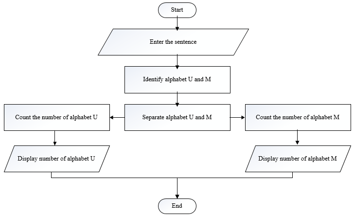
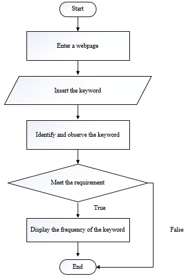
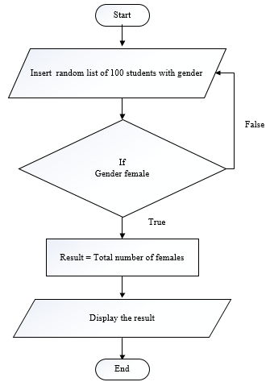
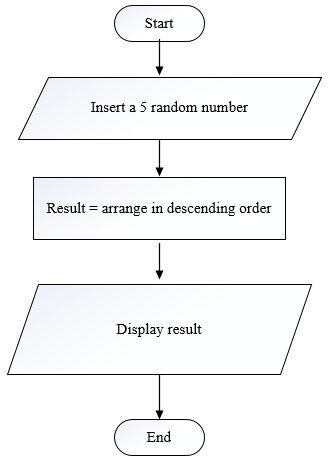
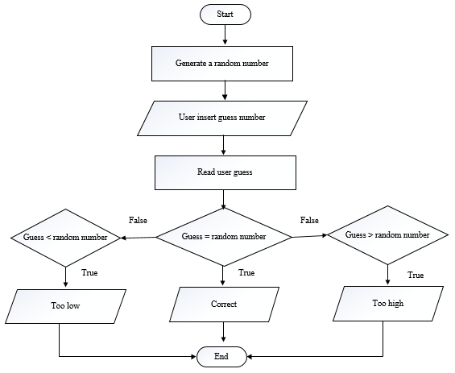

# Tutorial 1 (Part 2)(Psuedocode & Flow chart)

#### Thennagan A/L Paramasivan (WIC180064)

##### 8. Count the number of alphabet U and M from a sentence entered by user
>>
```
Input: Enter the sentence
Output: Number of alphabet U and M
       i.	Get the sentence from user
      ii.	Identify the alphabet U and M
     iii.	Separate the alphabet U and M
      iv.	Count the number of alphabet U 
       v.	Count the number of alphabet M
      vi.	Display the number of alphabet U
     vii.	Display the number of alphabet M
```

<br />
##### 9. Display a frequency of a keyword from a web page
>>
```
Input: Enter the keyword
Output: Frequency of the keyword
       i.	Enter the web page
      ii.	Identify and observe the keyword
     iii.	If meet the requirement
                   Display the frequency of the keyword  
                Otherwise
                   End
```

<br />
##### 10. Display the number of female student from a random list of 100 students
>>
```
Input: Random list of 100 students
Output: Total number of female students
      i.	Insert random list of 100 students with gender
     ii.	If gender female
                   Total the number of female
                Otherwise
                   Get other gender    
    iii.	Display the total number of female
```

<br />
##### 11. Display a list of 5 random numbers in descending order. (Sort)
>>
```
Input: 5 random numbers
Output: 5 random number in descending order
      i.	Get five random numbers
     ii.	Result = Arrange in descending order
    iii.	Display the result
```

<br />
##### 12. Guess a random number generated by computer
>>
```
Input:  A guess number
Output: Display whether guess number correct, too low or too high
      i.	Generate a random number
     ii.	User insert a guess number
    iii.	Read user guess number
     iv.	If (guess < random number)
                    Display too low
                        Else if (guess > random number)
                            Display too high
                Else (guess = random number)
                    Display Correct
```

<br />
